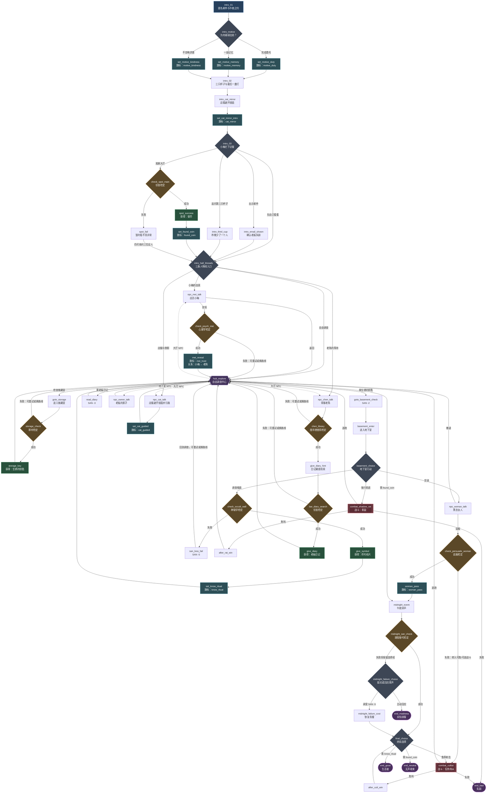

# Scenario_01 节点流 ·《咖啡馆关店后的失踪》

> H8 调查闭环基线；SP-2B-1 已补入雨夜开场与三条人物线入口。节点源文件：`Assets/Resources/Data/Scenarios/Scenario_01/nodes.json`。

## 完整节点流

## 当前可试玩闭环

主闭环已经形成两种明确路径：

1. `匿名邮件 → 选择来访动机 → 三只杯子与异常倒影 → 大厅三线入口 → 侦查成功 → 获得银币 → 解锁午夜钟声 → 终局 → 中立结局`。
2. `调查储藏室 → 获得钥匙 → 进入地下室 → 读懂符号 → 解锁仪式选项 → 终局 → 好结局`。

NPC 和日记分支负责补充氛围、关系与风险提示；狂热侍从战斗是缺少关键线索时仍可尝试的高风险出口。

## 失败回路约定

- 大厅首次侦查失败会回到 `intro_hall_threads`，仍可改问小梅、老陈或跟随店猫；聆听、神秘学、心理学和图书馆检定失败后会回到 `hub_explore`，玩家可以换路线或稍后重试。
- 说服黑衣女人失败会进入可胜利、可逃跑的战斗，不会直接锁死剧情。
- 午夜检定失败不再由一次骰子直接判定疯狂结局；玩家可付出 `SAN -5` 继续终局，也可主动回应歌声进入 `end_madness`。
- 影鼠与狂热侍从战斗都保留胜、负、逃出口。

自动测试 `InvestigationLoopTests.Scenario01_AllNonEndNodesHaveKnownExit_AndFourEndingsRemainReachable` 会检查所有非 End 节点至少有一个已存在的出口，并从 `startNodeId` 遍历确认四个结局都仍可抵达。
